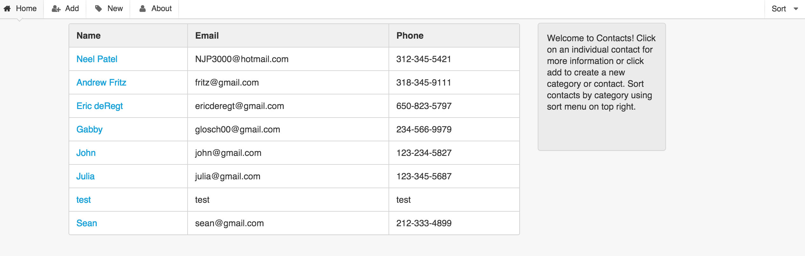
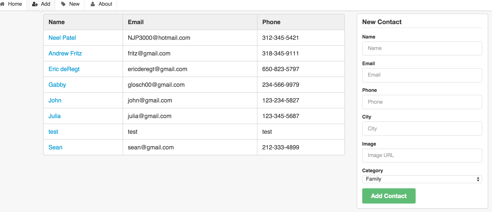

##Contact List

[Link to Deployed Version](http://45.55.169.72:3000)

[Link to Trello board](https://trello.com/b/137fwPRz/wdi-project-two)

##Features

**1. A user can view all of the items in the contact list**

**2. A user can CRUD contacts or categories by clicking the respective menu items**

**3. A user can sort the contacts by categories by clicking on the sort button on the upper right hand corner**

**APIs and Modules Used**
- json-server - used to simulate back-end
- mustache - used to render html
- Semantic UI - CSS templates
- Animate.css - CSS animations
- Director.js - Routes

**Instructions for Running on Localhost**
- download / clone repo
- in Contacts folder, run "npm install" in command line
